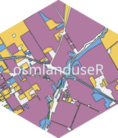
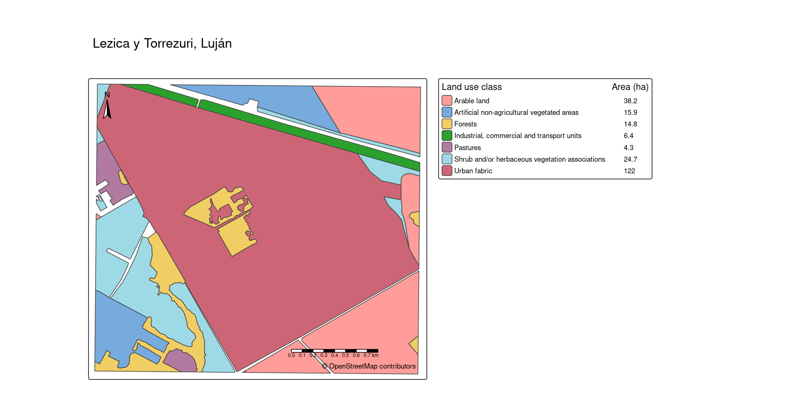

# osmlanduseR



A package designed to download, measure, 
classify and map land use data from OpenStreetMap.

The package incorporates features to consider polygons
and multipolygons tagged as _natural=\*_, _landuse=\*_, _amenity=\*_,
_aeroway=\*_, _leisure=\*_.

Two data sets are included to allow the classification of land use data in
the classes defined by the CORINE Land Cover and INTA-FAO systems.


## Installation

The package is under development and can be installed from:

```
install.packages("remotes")
remotes::install_github("aduhour/osmlanduseR", dependencies = TRUE)
```

## Usage

- Download land use data from the Lezica y Torrezuri locality in Luján:

```
area <-  "Lezica y Torrezuri, Partido de Luján"
landuse <- get_osmlanduse(area, crop_to = "bbox")
```


- Classify according to Corine Land Cover classes: 

```
data(clc)
classified <- classify_osmlanduse(landuse,osm_tag = clc$osm_tag,
class_name = clc$class_name)
```

- Map

```
map_osmlanduse(classified, title = "Lezica y Torrezuri, Luján")
```


