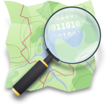

```{r setup, include=FALSE}
knitr::opts_chunk$set(echo = FALSE)
library(fontawesome)
library(sf)
#osmlanduse <- st_read("../../../../Proyectos/2015 - Cambios en el uso del suelo - inundaciones/Resultados/data/lujan-osmlanduse.geojson")
#area <- st_read("../../../../Proyectos/2015 - Cambios en el uso del suelo - inundaciones/Resultados/data/lujan-area.geojson")
#lujan <- list(area = area, osmlanduse=osmlanduse)
```

# Introduction

## Introduction

Over the past 30 years, Argentina has been experiencing changes in its agricultural and urban development model that have drastically altered land use practices and patterns [@Palmisano2018; @Pintos2012]. 

## Introduction


On a global scale, the expansion of capitalism through a process of accumulation by dispossession prevails. This is characterized by land privatization, the expulsion of farmers, the conversion or suppression of rights to the commons [@Harvey2004].

## Introduction

:::::::::::::: {.columns}
::: {.column width=50%}
{width=90%}
:::
::: {.column width="5%"}
\ 
<!-- an empty Div (with a white space), serving as
a column separator -->
:::
::: {.column width="40%"}
```{r}
total <- 2700758
cultivada <- 584353
herbaceos <- 556720
```


According to the land cover inventory made by the National Institute of Agricultural Technology, [@Volante2009]:

- Managed or cultivated areas covered 584353 km² (`r round(cultivada * 100 /total,2)` % of the total) and

- herbaceous crops accounted for 556720 km² (`r round(herbaceos * 100 /cultivada,2)` %).
:::
::::::::::::::


## Introduction


:::::::::::::: {.columns}
::: {.column width=55%}


:::
::: {.column width="5%"}
\ 
<!-- an empty Div (with a white space), serving as
a column separator -->
:::
::: {.column width="40%"}

These changes have been associated with flooding in several regions [@Pal2021; @Pattison2012] . 

In particular, the Luján River
basin (Buenos Aires, Argentina)
has experienced extreme events
historically.
:::
::::::::::::::


## Introduction


:::::::::::::: {.columns}
::: {.column width=55%}


:::
::: {.column width="5%"}
\ 
<!-- an empty Div (with a white space), serving as
a column separator -->
:::
::: {.column width="40%"}
\
The rising incidence and intensity of such events around the world has led to increased concern to study this relationship:

- China: @Liu2023
- Indonesia: @Sugianto2022
- Argentina: @Pal2021
- Brasil:  @daSilva2024
:::
::::::::::::::


## Introduction

<!-- (Despite looking redundant, in the context of this event, 
Despite its redundancy)  -->

The analysis of these changes in land use requires information typically obtained from remote sensing, which is validated and complemented with sampling programs.


The development of an updated land use map is a basic tool to study territorial phenomena such as flooding or land use change. Such an approach would enable the information to be compared to previously collected data on various scales and time periods.

## Introduction

Although, geographic information, its format, or processing tools do not generally allow for its reuse or improvement, and they are not necessarily openly/freely available. 

This type of data can be considered a _digital commons_ and may be the susceptible of mercantilization processes. 

Indeed, publicly produced information and processing tools should be made available in open-source formats and licenses to enforce knowledge construction [@Arsanjani2015; @Dufeal2017].

<!-- Por el contrario, es necesario desarrollar mecanismos de contribución -->
<!-- y libre circulación de datos territoriales, como una forma de abolir la -->
<!-- apropiación de lo que es un bien común: el acceso al conocimiento -->
<!-- públicamente generado (Schweik, 2007; Duféal y Noucher, 2017). -->

## Introduction

\centering

OpenStreetMap (OSM) is currently the main framework for volunteered geographic information, and because it constitutes a standardized database, it also allows it to be a preferred repository for contributions from universities and public sector research initiatives. 

Recently, OSM has been registered as a _public good_ by an agency affiliated to the United Nations: 
[`r fa("link", fill = "blue")`](https://app.digitalpublicgoods.net/a/10592)

## Introduction

The data contributed to OSM has already been incorporated into the creation and validation of land use and land cover maps, which are predominantly utilized in Europe: 

- Vienna, Austria: @Arsanjani2013;
- Paris, France; Milan, Italy: @Fonte2016; 
- Heidelberg, Germany: @Schultz2017.

These authors have developed methods and algorithms for retrieving, analyzing, and classifying OSM data to produce land use maps. 

## Introduction

From these works also derived the [osmlanduse.org `r fa("link", fill = "blue")`](osmlanduse.org) initiative, which delivers OSM land-use/land-cover information mapped to CORINE classes as a Web Map Service (WMS).

{width=90%}

## Introduction

In different countries, the local community of OSM users has contributed a substantial amount of geographic information that could be used for land use analysis, which might be expanded further, particularly in non-urban areas. 

The general scheme for describing geographic elements provided by OSM can be applied to land use mapping by combining that information with country-specific classification systems.

## Introduction

On this basis, there is a need for tools that can be applied at the local level to promote interaction with participatory mapping processes. 

Such an approach would facilitate harmonization of OSM data with other classification systems, including those created by FAO or defined by users.

## Introduction

- As a consequence, the objective of this study is to present the development of an `r fa("r-project", fill = "steelblue")` package for the analysis of land use data contributed to OSM. 

- Overall, the aim is to increase the contribution of publicly generated information and its analysis tools in an open access format, such as those provided by OSM and `r fa("r-project", fill = "steelblue")` [@RCT2023].

# Materials and Methods

## Creation of a land use map in OpenStreetMap

Since 2016, land use data of the Lujan River’s middle basin have been contributed to OSM as part of projects conducted by the National University of Luján. 

Land use was visually assessed using satellite imagery, and representative polygons were added with appropriate tags. Geometries were created preferably as multipolygons. 

## Creation of a land use map in OpenStreetMap

The boundaries of each geometry were drawn to avoid sharing nodes with the road and rail networks. 

The JOSM program was used for OSM edition, using imagery available within the program, provided by Bing, Mapbox, Digital Globe, and the National Geographic Institute of Argentina, with capture dates from 2016 to 2020.

\centering 

{width=10%}


[JOSM: Java editor for OSM](https://josm.openstreetmap.de/)

## `r fa("r-project", fill = "steelblue")` package implementation

\centering

`r fa("wrench")`

The package is in the early stages of development 

`r fa("github")` 

The code repository is accessible in [https://github.com/aduhour/osmlanduseR](https://github.com/aduhour/osmlanduseR).

## `r fa("r-project", fill = "steelblue")` package implementation

The package comprises a number of features aimed at: 

1) Download a set of land use related data from OSM using the overpass API: (**get_osmlanduse function**); 

2) Remove overlaps, measure polygon area and classify polygons by mapping OSM tags to user-defined classes 
(**classify_osmlandse function**).

3) Provide example data sets for the translation of OSM land use tags to classification systems with extended use, such as the CORINE Land Cover and FAO Land Cover Classification System.

4) Create a land use classification map 
(**map_osmlandse function**). 


## `r fa("r-project", fill = "steelblue")` package implementation

### 1. _get_osmlanduse_ function

The _get_osmlanduse_ function takes as argument an objective region that can be defined as a polygon element in _sf_ (simple features) format or as a character string containing the name of a region. 

These input data is used to obtain the bounding box to set the overpass API query. 

## `r fa("r-project", fill = "steelblue")` package implementation

### 1. _get_osmlanduse_ function

The OSM features retrieved are those tagged as $natural= *$, $landuse= *$, $amenity = *$, $aeroway = *$ and $leisure = *$. 

At present, only the polygon objects are considered in the function implementation. 

Finally, the invalid geometries are fixed and a list containing the objective area and the land use data is returned.

The land use data is optionally intersected by the input polygon or the bounding box.

## `r fa("r-project", fill = "steelblue")` package implementation

### 2. *classify_osmlanduse* function

The *classify_osmlanduse* function takes the output of the previously described function and:

- transforms the data to the selected coordinate reference system,

- detects overlapping polygons and measures the area of the elements. 

- assigns a land use class to each polygon, matching existing OSM keys to a user-defined list of class names. 

## `r fa("r-project", fill = "steelblue")` package implementation

### 2. *classify_osmlanduse* function


Overlaps are resolved by two optional methods: 

a) prioritizing the _smaller_ polygons according to @Schultz2017.

b) prioritizing polygons in a _hierarchichal_ order of land use classes, as suggested by @Fonte2016. 


## `r fa("r-project", fill = "steelblue")` package implementation

### 3. Data sets

Two data sets integrate the package to be used in classification:

- The data set *clc* is an example of the legend harmonization between OSM tags and Corine Land Cover classes proposed by @Schultz2017. 

- The dataset *intafao* is a translation of OSM tags to the FAO Land Cover Classification System adopted by the National Institute of Agricultural Technology (Argentina) [@Volante2009].

## `r fa("r-project", fill = "steelblue")` package implementation

### 4. *map_osmlanduse* function

The _map_osmlanduse_ function takes the classified set of data and returns a land use thematic map.

## Dependencies

\centering 

The implemented procedures use functions from the packages

<!-- Package stickers -->

{height=2cm}
{height=2cm}
{height=2cm}

[@Padgham2017; @Pebesma2018; @Tennekes2018]


# Usage

## Package usage

- By calling the function **get_osmlanduse** with default arguments, the land use data of Luján in Buenos Aires, Argentina is dowloaded:

```{r get, echo = TRUE, eval=FALSE}
 lujan <- get_osmlanduse()
 lujan$osmlanduse
```

{width=80%}

## Package usage

- Then, the result can be classified in the classes of the CORINE Land Cover
scheme using the data set _clc_

```{r clc, echo = TRUE, eval=FALSE}
data(clc)
lujan.clc <- classify_osmlanduse(lujan$osmlanduse, 
                                       clc$osm_tag,
                                       clc$class_name) 
```

{width=90%}

## Package usage

```{r mapclc, echo = TRUE, eval=FALSE}
map_osmlanduse(lujan.clc, "Partido de Luján")
```


# Results and discusion

## Land use map

The methods developed in the package osmlanduseR were employed to download the elements associated with land use from OSM. 

The geometric operations oriented to remove overlapping were successfully accomplished, and the matching of the present tags with a user-defined list of land use classes resulted in the map presented in Figure 1. 

The land use polygons retrieved from OSM in the municipality of Luján were found to cover 71407.8 ha, or 92.4% of the total area.

## Land use map

{width=80%}


## Future work and new features.

The results obtained in the development of osmlanduseR represent a preliminary model for the incorporation of additional functions and other features documented in previous research. 

## Future work and new features.

## Linear elements

Including linear elements, such as those related to the road and rail network or the waterways into the analysis of land use could be made as proposed by @Fonte2016,
provided that the appropriate assumptions are made regarding the width of each linear element.

## Future work and new features.

### Inference from other map elements

The current stage of the osmlanduseR package enables the incorporation of a tool that allows the inference of land use from elements such as POIs, buildings, road network, tags combination, etc.

This can be accomplished by using the tree decision approach proposed by @Arsanjani2013. 

## Future work and new features.

### Filling gaps

In their study, @Schultz2017 described a method for using the information available in OSM as a training tool for supervised classification of remote sensing data, with the objective of filling data gaps. 

<!-- Integration with sits package [@Simoes2021a] -->

## Future work and new features.

### Map accuracy

An important component to add in the future is a method for estimating the accuracy of a classification derived from other sources or constructed using other methods in a specific area.

## Future work and new features.

### OpenStreetMap data improvements

A new feature to add is the integration with workflows for improving OSM map data.

The package can implement the detection of issues, for example those related to overlapping, tag consistency, 

# Conclusions

## Conclusions

The work conducted since the initial development of osmlanduseR has made it possible to use data from OSM for land use analysis and to implement a classification system.

Additionally, the developed package provides a basis for integrating additional complementary methodologies referenced in previous research into a unified platform.

## Conclusions

Among them, it is critical to continue improving osmlanduseR to allow the use of OSM tags as training to categorize unknown areas from remotely sensed imagery, and inferring land use classes from POIs, buildings, or linear features. It is also necessary to incorporate methods for calculating map accuracy. 

## Conclusions

This approach enables a systematic analysis of the information available in OSM, resulting in a new tool that can be integrated into participatory mapping processes and used to enhance initiatives for open and public access to information.

## Thank you! - ¡Muchas gracias!

\centering


{width=3.5cm}

Andrés Duhour:
`r fa("paper-plane")` `r fa("github")` aduhour
`r fa("envelope")`  aduhour\@unlu.edu.ar


{height=1.2cm}
{height=1.2cm} {height=1.2cm}

# References

## References {.allowframebreaks}
